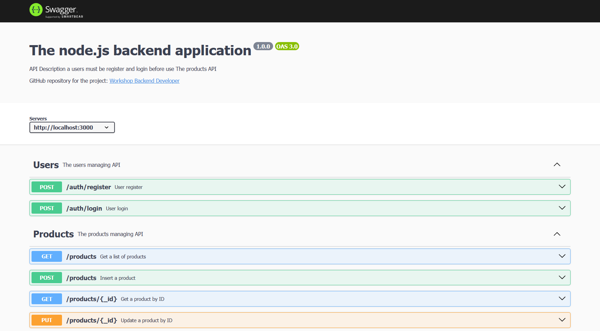

# The node.js backend application
API for managing a products in database



## get started
1. Clone this repository
2. Install dependency 
```bash
npm install
```
3. Build a docker compose 
```bash
docker compose up
```
4. Go to link : [(Swagger document API)](http:127.0.0.1:3000/api-docs) to testing

> Notics: CSV file example locate at '/src/data.csv'